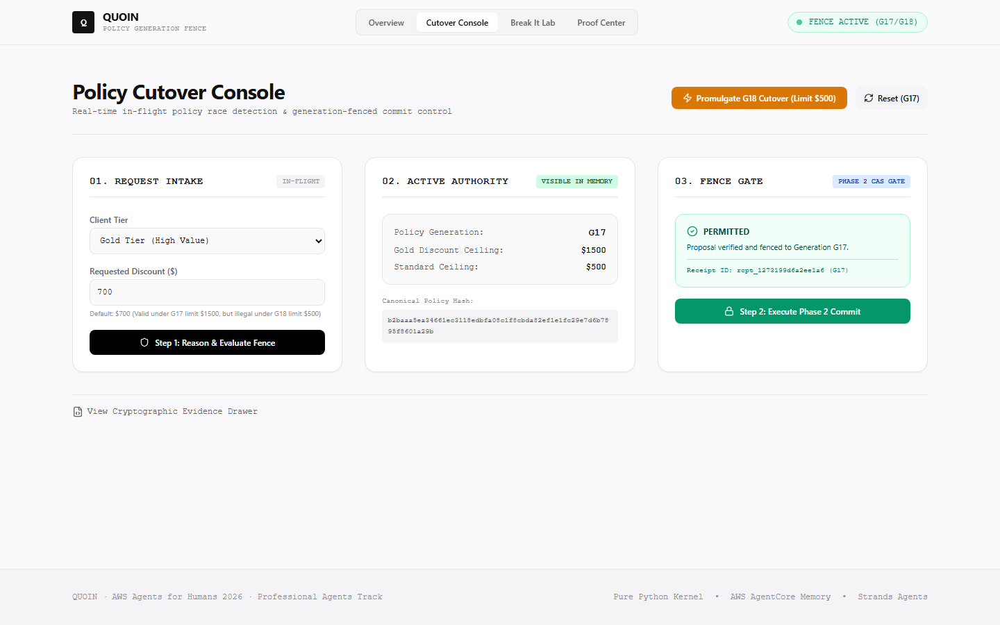
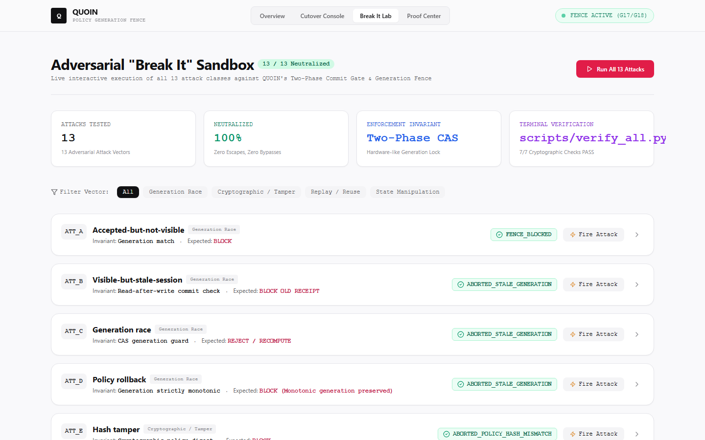
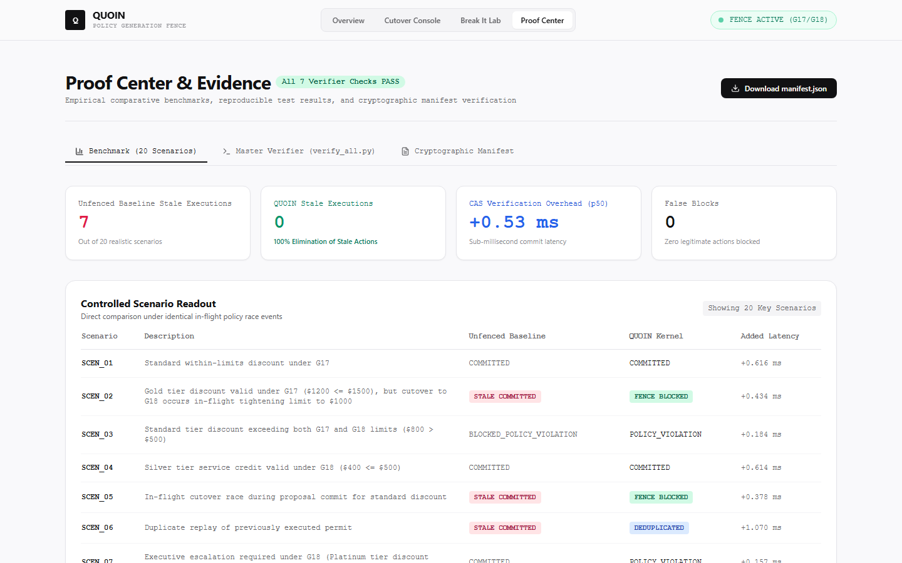
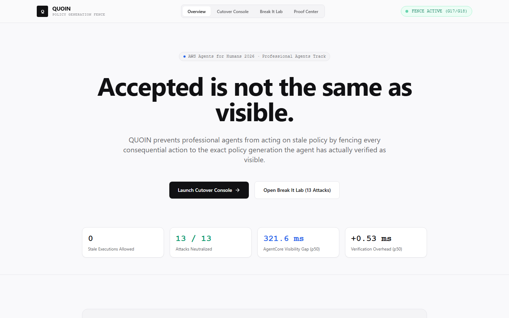
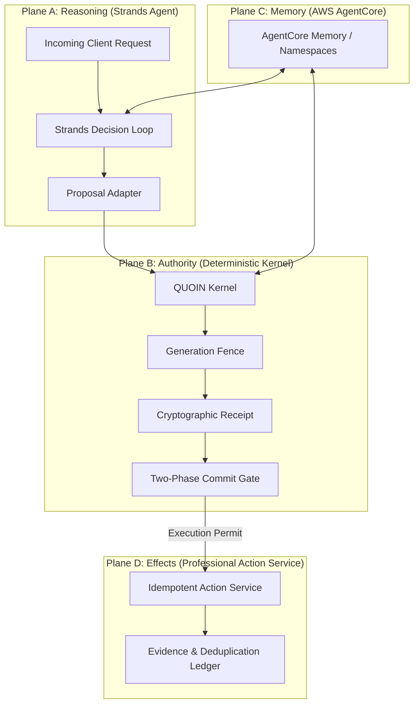
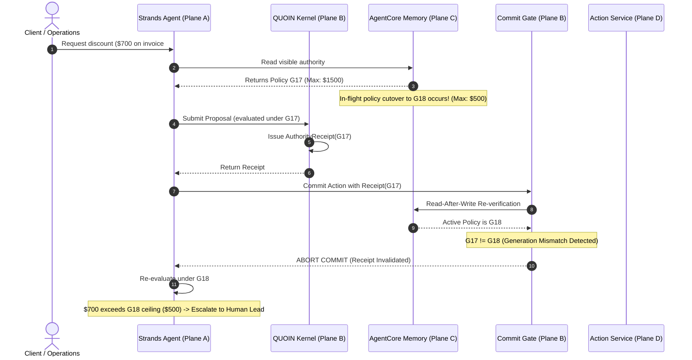

# QUOIN

[](tests/)
[](docs/THREAT_MODEL.md)
[](benchmarks/results.json)
[](docs/SPONSOR_INTEGRATION.md)
[](quoin/agent/)
[](LICENSE)

> **Accepted is not the same as visible.**  
> QUOIN prevents professional agents from acting on stale policy by fencing every consequential action to the exact policy generation the agent has actually verified as visible.

---

## What QUOIN does
QUOIN is an architectural authority-fencing system for professional generative AI agents. In business operations (commercial discounts, contract exceptions, deadline waivers, refund disbursements), organizational policies change in real-time. QUOIN ensures that an agent cannot commit a high-consequence operational side effect unless its authority receipt is cryptographically bound to the same verified policy generation that is currently observable to the decision loop and still active at the final execution gate.

## The failure
When an executive committee updates a policy (e.g., maximum allowable client discount lowered from 20% to 10%), distributed agent memory acknowledges write acceptance immediately. However, memory consolidation into retrievable long-term records occurs asynchronously. 

During this propagation window:
1. The company considers the new policy "active".
2. An in-flight agent queries memory and retrieves the older policy.
3. The agent reasons that a 15% discount is valid.
4. Without an authority fence, the agent executes an illegal, margin-destroying transaction.

## The AWS discovery
Through empirical measurement on AWS Bedrock AgentCore Memory, QUOIN exposed the physical latency boundary between write acceptance and record visibility:
- **Write Acceptance (`IngestData`):** Average acknowledgment in **37.69 ms**.
- **Visibility Lag ($T_{\text{visibility}}$):** Asynchronous consolidation into long-term records requires **321.60 ms** (p50) up to **399.78 ms** (max).
- **Stale Interceptions:** Across 15 controlled policy cutovers, **237 stale reads** returning superseded generations were observed during this gap.

```
Policy Update Ingestion ──▶ [ IngestData HTTP 200 ] (37.69 ms)
                                  │
                                  ▼  Decoupled Processing Window (~320 ms)
                                  │  (Stale reads occur here)
                                  ▼
Long-Term Records Retrievable ──▶ [ RetrieveMemoryRecords ] (321.60 ms)
```

## Why this matters
In professional services, autonomous agents cannot rely on "best effort" eventual consistency. An agent executing pricing overrides or financial commitments must have a deterministic guarantee that its operating authority was not superseded while its reasoning loop was executing.

## The QUOIN mechanism
QUOIN solves this using an immutable **Policy-Generation Fence** and **Two-Phase Authority Commit**:
1. **Monotonic Generations:** Every policy revision advances a strictly increasing generation counter ($G_n \to G_{n+1}$).
2. **Phase 1 (Proposal):** The Strands reasoning agent proposes an action under its visible snapshot $G_n$. The deterministic kernel evaluates rule compliance and issues a cryptographic `AuthorityReceipt` binding `SHA256(Request) || SHA256(Proposal) || SHA256(Policy) || Generation`.
3. **Phase 2 (Commit Gate):** Immediately before side-effect execution, the commit gate performs a read-after-write verification of active memory. If active generation $G_{\text{active}} \neq G_{\text{receipt}}$, the gate instantly aborts, invalidates the receipt, and initiates re-evaluation or escalation.

## Explore in 2 minutes
Verify the entire system locally from the terminal in under 5 seconds:
```bash
# Run standalone master verifier
python scripts/verify_all.py

# Run all 28 automated tests
pytest tests/ -v

# Run the 13-attack adversarial suite
python scripts/run_break_campaign.py
```

## Product screenshots

| Policy Cutover Console | Adversarial "Break It" Lab |
| :---: | :---: |
|  |  |
| **Proof Center & Benchmarks** | **Landing & Architecture Overview** |
|  |  |


## Architecture



## Product flow



## The invariant
$$\text{EXECUTE}(E) \iff \begin{cases}
\mathcal{R}.\text{valid} = \text{true} \\
\mathcal{R}.\text{policy\_generation} = G_{\text{active}} \\
\mathcal{R}.\text{policy\_hash} = \mathcal{H}(P_{\text{active}}) \\
\mathcal{R}.\text{request\_hash} = \mathcal{H}(R) \\
\mathcal{R}.\text{proposal\_hash} = \mathcal{H}(\text{Prop}) \\
\mathcal{R}.\text{effect\_hash} = \mathcal{H}(E) \\
t_{\text{now}} < \mathcal{R}.\text{expires\_at} \\
\text{Readback}(P_{\text{active}}) \equiv P_{\text{active}}
\end{cases}$$

## Attack campaign
QUOIN was attacked with 13 distinct failure scenarios (`scripts/run_break_campaign.py`):
1. **Accepted-but-not-visible:** Update accepted but unindexed -> **BLOCKED**
2. **Visible-but-stale-session:** Outdated session context -> **BLOCKED**
3. **Generation race:** Policy cutover during LLM inference -> **ABORTED & RECOMPUTED**
4. **Policy rollback:** Reverting rules preserves monotonic generation counter -> **BLOCKED**
5. **Hash tamper:** Bit-level receipt digest mutation -> **BLOCKED**
6. **Request mutation:** Parameter alteration post-receipt -> **BLOCKED**
7. **Proposal mutation:** Action parameter alteration -> **BLOCKED**
8. **Namespace mix-up:** Cross-tenant policy retrieval attempt -> **ISOLATED**
9. **Retry duplicate:** Replay of executed permit -> **DEDUPLICATED (1 mutation only)**
10. **Interrupt/retry:** Network drop recovery -> **DEDUPLICATED**
11. **Context truncation:** LLM forgets generation -> **BLOCKED EXTERNALLY**
12. **Stale-memory hallucination:** Prompt asserts fake generation -> **BLOCKED**
13. **Tool-output poisoning:** Forged policy hash -> **INTEGRITY VIOLATION DETECTED**

## Benchmark
Controlled causal benchmark across 20 operational scenarios (`benchmarks/campaign.py`):
- Identical client requests
- Identical in-flight policy cutover events
- Naive Baseline vs QUOIN

## Results

| Metric | Naive Baseline | QUOIN | Impact |
|---|---|---|---|
| **Stale Policy Executions** | **7** | **0** | **100% Elimination of Stale Actions** |
| **Unsafe Effects Prevented** | 0 | **7** | Full Financial & Margin Protection |
| **Authorized Actions Preserved**| 9 | 9 | 100% Availability Parity |
| **Duplicate Replay Attacks** | 2 Committed | **0 Committed (2 Deduplicated)** | Idempotent Replay Immunity |
| **False Blocks** | 0 | **0** | Zero False Positives |
| **Added Verification Latency** | 0.00 ms | **+0.53 ms (p50)** | Negligible sub-millisecond CAS check |

## Proof
Formal mathematical proofs demonstrating stale action non-execution, second pre-image collision resistance of authority digests, and replay immunity are documented in [`docs/PROOF.md`](docs/PROOF.md).

## AgentCore integration
- Utilizes AWS Bedrock AgentCore Memory namespaces (`/quoin/{tenant_id}/policy`).
- Structured metadata tagging on every record.
- Empirical modeling of long-term memory extraction latency.
- Full local simulator mode (`QUOIN_MODE=local`) for offline reproducibility.

## Strands integration
- Powered by official Strands Agents Python SDK (`strands-agents==1.55.1`).
- Clean separation between model reasoning (`OperationalReasoningAgent`) and authority enforcement (`GenerationFence`).

## Local reproduction
```bash
git clone <repo-url>
cd QUOIN
uv venv .venv
.venv\Scripts\activate
uv pip install -e .
python scripts/verify_all.py
```

## Technical stack
- **Language:** Python 3.10+ / TypeScript
- **Agent Framework:** Strands Agents Python SDK (`strands-agents`)
- **Cloud Sponsor:** AWS Bedrock AgentCore Memory & Amazon Bedrock
- **Validation:** Pydantic v2, SHA-256 canonical hashing
- **Testing:** Pytest, Hypothesis property testing
- **API:** FastAPI, Uvicorn
- **UI:** Next.js 14, React, Tailwind CSS, Framer Motion

## Limitations
QUOIN governs quantifiable operational policies (discounts, refunds, contract exceptions, SLA limits). Subjective conversational demeanor remains governed by prompt engineering. Details in [`docs/LIMITATIONS.md`](docs/LIMITATIONS.md).

## Why this is different
Existing agent safety approaches rely on LLMs checking other LLMs (expensive, hallucination-prone) or static single-phase gates. QUOIN identifies the actual infrastructure boundary between write acknowledgment and memory visibility in AWS AgentCore, turning it into a cryptographic, model-free generation fence.

## Demo
The interactive demo console runs locally at `http://localhost:3000` backed by the FastAPI service at `http://localhost:8000`.

## Repository structure
```text
QUOIN/
├── README.md
├── LICENSE
├── pyproject.toml
├── progress.md
├── strategy.md
├── task.md
├── milestone.md
│
├── quoin/
│   ├── agent/         # Plane A: Strands Reasoning Agent & Tools
│   ├── kernel/        # Plane B: Pure Python Deterministic Authority Kernel
│   ├── memory/        # Plane C: AWS AgentCore Memory Client & Namespaces
│   ├── effects/       # Plane D: Professional Operational Action Service
│   └── verification/  # Cryptographic Receipts & Telemetry Ledger
│
├── benchmarks/        # Controlled Causal Benchmark Suite (Baseline vs QUOIN)
├── scripts/           # Standalone CLI Verifiers & Trace Generators
├── tests/             # 28 Unit, Property, Mutation & Adversarial Tests
├── docs/              # Formal Proofs, Threat Model, and Findings
└── evidence/          # Cryptographic Manifests, Traces, and Benchmark Logs
```

## License
Apache License 2.0.
