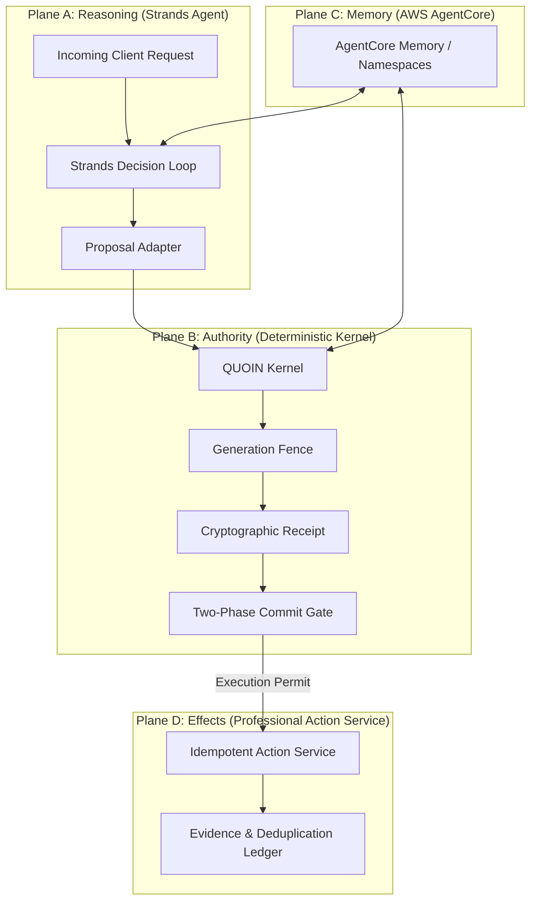

# QUOIN Four-Plane Architecture Specification

QUOIN enforces complete separation of concerns across four decoupled planes:

## 1. Plane A: Reasoning Plane (Strands Agent)
- **Runtime:** Official Strands Python SDK (`from strands import Agent, tool`) with Amazon Bedrock Nova Lite (`us.amazon.nova-lite-v1:0`).
- **Role:** Natural language request parsing, intent classification, policy rule evaluation, and candidate proposal formulation.
- **Tools:** `query_visible_policy` (inspects visible memory generation) and `StrandsProposalOutput` (structured typed proposal).
- **Boundary:** Strictly unprivileged for authority. Zero direct tool execution credentials, zero database write permissions, and no commit gate access.

## 2. Plane B: Authority Plane (Deterministic Kernel & 2PC Gate)
- **Runtime:** Pure Python model-free deterministic engine with Amazon DynamoDB / SQLite durable ledger.
- **Role:** Evaluates proposals against generation-scoped policy rules, computes canonical SHA-256 digests, issues signed `AuthorityReceipt` objects, and executes Phase 2 compare-and-swap (CAS) commit verification with single-use permit consumption.
- **Invariants:** Model-free. Immune to prompt injection, semantic drift, and LLM confabulation.

## 3. Plane C: Memory Plane (AWS AgentCore Memory & DynamoDB Ledger)
- **Runtime:** Amazon Bedrock AgentCore Memory (`bedrock-agentcore` data plane) for semantic context + Amazon DynamoDB (`quoin_authority_ledger`) for authoritative epochs.
- **Data-Plane Operations:** `batch_create_memory_records`, `ingest_data`, `retrieve_memory_records`, `list_memory_records`.
- **Namespaces:**
  - `/quoin/{tenant_id}/policy`: Active policy records and generation digests.
  - `/quoin/{tenant_id}/policy_history`: Superseded policy generations.
  - `/quoin/{tenant_id}/decisions`: Committed decisions and permit hashes.
- **Telemetry:** Measures physical latency between `IngestData` acceptance and `RetrieveMemoryRecords` visibility.
- **Fail-Loud:** In production (`QUOIN_MODE=agentcore`), fails loudly via `AgentCoreUnavailableError` with zero silent fallback.

## 4. Plane D: Effects Plane (Operational Action Service)
- **Runtime:** Idempotent side-effect execution service.
- **Role:** Applies commercial discounts, issues billing credits, grants deadline exceptions.
- **Safety Guarantee:** Requires a single-use signed `ExecutionPermit`. Enforces replay protection via an immutable deduplication ledger.
