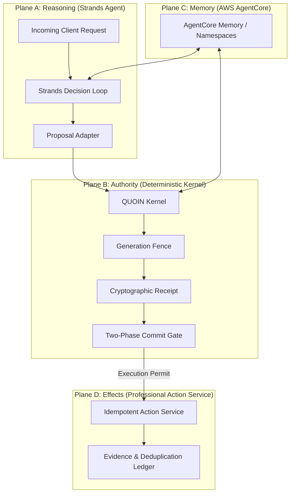

# QUOIN Four-Plane Architecture Specification

QUOIN enforces complete separation of concerns across four decoupled planes:

## 1. Plane A: Reasoning Plane (Strands Agent)
- **Runtime:** Strands Python SDK (`strands-agents>=1.0.0`).
- **Role:** Natural language request parsing, intent classification, business justification extraction, and candidate proposal formulation.
- **Boundary:** Strictly untrusted for authority. Cannot directly execute effects, cannot bypass the kernel, and cannot access the commit gate.

## 2. Plane B: Authority Plane (Deterministic Kernel)
- **Runtime:** Pure Python model-free deterministic engine.
- **Role:** Evaluates proposals against active policy rules, computes canonical SHA-256 digests, issues signed `AuthorityReceipt` objects, and executes Phase 2 compare-and-swap (CAS) commit verification.
- **Invariants:** Model-free. Immune to prompt injection, semantic drift, and hallucination.

## 3. Plane C: Memory Plane (AWS AgentCore Memory)
- **Runtime:** Amazon Bedrock AgentCore Memory with local simulator reproduction mode.
- **Namespaces:**
  - `/quoin/{tenant_id}/policy`: Active policy records and generation digests.
  - `/quoin/{tenant_id}/policy_history`: Superseded policy generations.
  - `/quoin/{tenant_id}/decisions`: Committed decisions and permit hashes.
- **Telemetry:** Measures physical latency between `IngestData` acceptance and `RetrieveMemoryRecords` visibility.

## 4. Plane D: Effects Plane (Operational Action Service)
- **Runtime:** Idempotent side-effect execution service.
- **Role:** Applies commercial discounts, issues billing credits, grants deadline exceptions.
- **Safety Guarantee:** Requires a single-use signed `ExecutionPermit`. Enforces replay protection via an immutable deduplication ledger.
